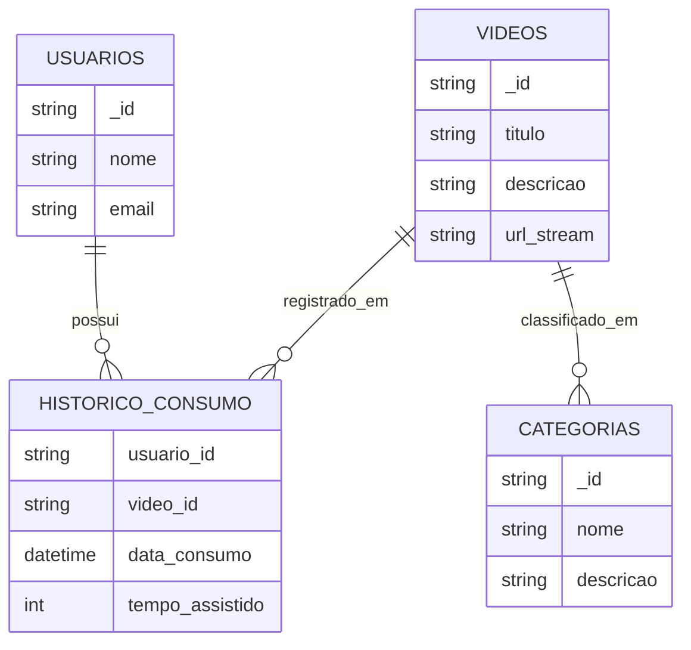

# Banco de Dados – Atividades

## Esquema de Banco de Dados NoSQL para aplicação de vídeos on-line

### Cenário
Usuários cadastrados podem consumir arquivos de **streaming (vídeos)**, os quais são **classificados por categorias**.  
Também é necessário armazenar o **histórico de consumo** de cada cliente.

### Tipo de Banco de Dados NoSQL recomendado
O mais indicado seria um **Banco de Dados Orientado a Documentos** ideal é o Mongo, pois:
- Permite armazenar informações de usuários, vídeos e categorias em documentos JSON flexíveis.
- Facilita consultas por categorias, usuários e histórico.
- Suporta escalabilidade horizontal, essencial para aplicações de streaming.


### Esquema sugerido (MongoDB)
#### Coleção: `usuarios`
```json
{
  "_id": "u123",
  "nome": "Arnaldo Pereira",
  "email": "ogradearnaldo@email.com",
  "historico_consumo": [
    {
      "video_id": "v456",
      "data_consumo": "2025-08-25T19:20:00Z",
      "tempo_assistido": 1200
    }
  ]
}
```
#### Coleção: videos
```json
{
  "_id": "v456",
  "titulo": "Introducao a AWS",
  "descricao": "Aula sobre conceitos de Cloud AWS",
  "url_stream": "https://servidor/videos/intro-aws",
  "categorias": ["Educação", "Tecnologia"]
}
```
#### Coleção: categorias
```json
{
  "_id": "c789",
  "nome": "Educação",
  "descricao": "Vídeos voltados para ensino e aprendizado"
}

```
# Esquema NoSQL para Aplicação de Vídeos Online



Esse diagrama mostra:  
- Usuários possuem histórico de consumo.  
- Vídeos aparecem no histórico.  
- Vídeos pertencem a uma ou mais categorias.  

Quer que eu adapte esse esquema para **banco de grafos (Neo4j)** também, já que o caso de uso de recomendações poderia se beneficiar disso?
